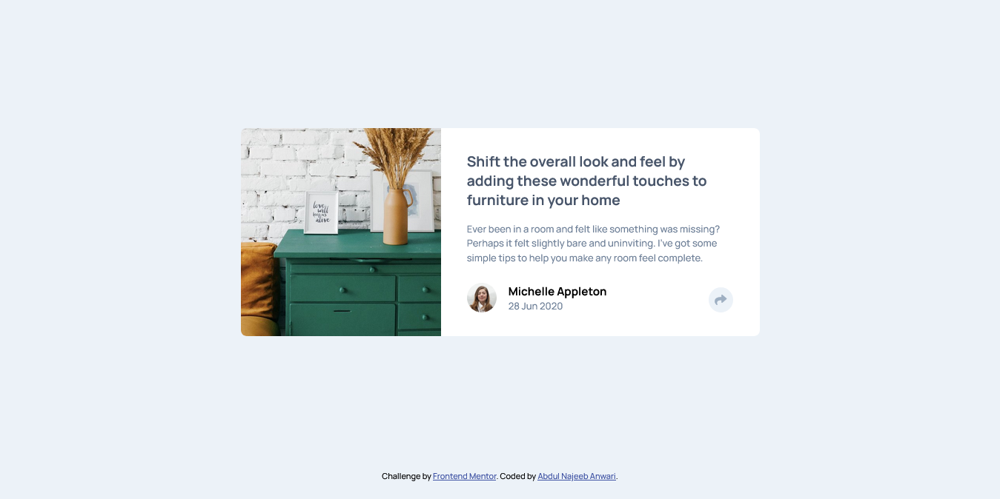
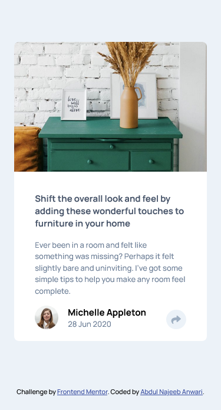

# Frontend Mentor - Article preview component solution

This is a solution to the [Article preview component challenge on Frontend Mentor](https://www.frontendmentor.io/challenges/article-preview-component-dYBN_pYFT). Frontend Mentor challenges help you improve your coding skills by building realistic projects. 

## Table of contents

- [Overview](#overview)
  - [The challenge](#the-challenge)
  - [Screenshot](#screenshot)
  - [Links](#links)
- [My process](#my-process)
  - [Built with](#built-with)
  - [Useful resources](#useful-resources)
- [Author](#author)

## Overview

### The challenge

Users should be able to:

- View the optimal layout for the component depending on their device's screen size
- See the social media share links when they click the share icon

### Screenshot

### Links

- Solution URL: [Solution URL](https://github.com/najeeb-anwari/article-preview-component)
- Live Site URL: [Live URL](https://najeeb-anwari.github.io/article-preview-component/)

## My process

### Built with

- Semantic HTML5 markup
- CSS custom properties
- Flexbox
- CSS Grid
- Mobile-first workflow
- [React](https://reactjs.org/) - JS library
- [Next.js](https://nextjs.org/) - React framework
- [Styled Components](https://styled-components.com/) - For styles

### Useful resources

- [CSS Diner](https://flukeout.github.io/) - I'd recommend it to anyone because it is an interactive game to practice CSS Selectors.
- [Flexbox Froggy](https://flexboxfroggy.com/) - This is an amazing website which helped me review my flexbox skills. I'd recommend it to anyone because it is an interactive game to practice flexbox.
- [Grid Garden](https://cssgridgarden.com/) - This is an amazing website which helped me review my Grid skills. I'd recommend it to anyone because it is an interactive game to practice Grid.

## Author

- Frontend Mentor - [@najeeb-anwari](https://www.frontendmentor.io/profile/najeeb-anwari)
- Github - [@najeeb-anwari](https://github.com/najeeb-anwari)
